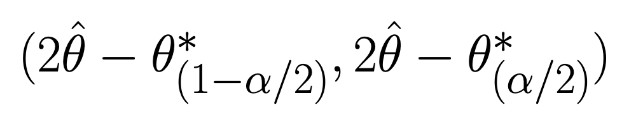

class: center, middle, title

# When the Bootstrap Breaks

.highlight[Ryan Harter] - 
Principal Data Scientist, Mozilla

---

# Format

* ~45m of me talking
* ~30m of Q&A
  * Questions in Slack
  * Any other questions - harterrt@gmail.com

---

# Who am I?

* Principal Data Scientist @ Mozilla
  * Retention, Search, Data Engineering
  * Setting goals
* ~10 years working with data

* Writing:
  * [blog.harterrt.com](blog.harterrt.com)
  * [harterrt@gmail.com](mailto:harterrt@gmail.com)
  * [Practical Data Science @ Newline](https://www.newline.co)

---

# What are we talking about?

I'm going to strip some of the varnish off the bootstrap.

I recently did a deep dive while building out our experiments pipeline.

I want to share what we learned with you.

---

# Who are you?

* Comfortable with stats (z-test, confidence intervals)
* Some basic coding experience (python: loops, functions)
* This talk might get boring to Stat Phd’s

---

# Definitions

* Understanding the distribution of estimators. 
* In practice:
  * How sure are we in this number? (confidence intervals)
  * Are these two quantities different? (hypothesis testing)
* Most common alternative is asymptotic normality

---

# Sketch


---

# Conventions

* **Sample** - a.k.a. “your data”
* **Pseudo-sample** - An artificial dataset created by sampling with replacement from our sample
* **Statistic** - A metric computed from the sample data
* **Resampled Statistic** - The same metric, but applied to a pseudo-sample
* **Confidence Intervals**: use the format: point(lower_bound, upper_bound)
  * `6.0 (1.1, 0.9)` means 6.0 ± 4.9

---
class: center, middle, title

# The Bootstrap: Advantages

---

# The Bootstrap: Advantages

* Asymptotic normality mostly applies to means.
  * Means are easy
  * What about Medians?
  * What about learned parameters?
* Particularly nice when you don’t know what metrics you’ll be using

---

# Bootstrap Example

```python
def basic_bootstrap(data, f):
  point_estimate = f(data)
  bootstraps = [
    f(data.resample(frac=1, resample=True)) - point_estimate
    for x in 100
  ]

  return(
    point_estimate,
    point_estimate - bootstraps.quantile(0.05),
    point_estimate - bootstraps.quantile(0.95)
  )
```

---

# Bootstrap Example

```python
# Schema:
#   client_id:          String UUID, dataset key
#   experiment_branch:  String: "control" or "experiment"
#   page_views:         Integer count of page loads
data = pd.read_csv('data.csv')

# Compute the mean
bootstrap(data, lambda d: mean(data['page_views']))

# Compute the median
bootstrap(data, lambda d: data['page_views'].quantile(0.5))
```
---

# Bootstrap Example

```python
# Compute experiment summaries (!)
def change_in_page_views(data):
  branch_summaries = (
    data
    .groupby('experiment_branch')
    .mean()
  )

  return(branch_summaries['experiment'] / branch_summaries['control'])

bootstrap(data, change_in_page_views)
# (0.04, 0.01, 0.07) -> 4.0% (1.0%, 7.0%)
```

Pseudo-code here: http://go.harterrt.com/bootstrap_pseudo

---
class: center, middle, title

# The Bootstrap: <strike>Advantages</strike>

---

# No Normality Assumptions

* Totally true!
* Not very motivating

---

# The CLT - Surprisingly Robust

* Remember! CLT says the sample mean is normally distributed
* Does not require the source distribution to be normal
* E.g. 100 coin flips
  * Each flip is not normal
  * The mean of many flips approaches normal
* CLT does require:
  * Finite Variance
  * Big N

---

# Bootstrap vs CLT - Simulations

* Simulate Type I error for increasing sample sizes
  * Sample sizes: Powers of 2 between 16 through 16384
  * For each sample size, take 1000 samples (meta-iterations)
      * Bootstrap with 200 resamples
      * Calculate T-dist and Z-dist confidence intervals
      * Test whether the CI contains the sample mean
* We want to see Type I error ~95%

https://github.com/harterrt/when_the_bootstrap_breaks

---

# Bootstrap vs CLT - Coin Flip


---

# The CLT - Small N?

Remember - the CLT requires *Big N* and *Finite Variance*

---

# Bootstrap vs CLT - 1% Binomial


---

# Bootstrap vs CLT - Pereto 3


---

# Bootstrap vs CLT - Pereto 3


---

# Bootstrap vs CLT - Small N

* Bootstrap is often recommended for small-n
  * Tighter intervals!
  * Looks better!
* All false confidence


---

# Bootstrap vs CLT - Infinite Variance

* Most common argument I’ve seen for the bootstrap
  * “Our data is too skewed to use asymptotic normality”
* Unfortunately, the bootstrap also requires finite variance
  * Otherwise it converges to the wrong value (!!)

---

# Bootstrap vs CLT - Pereto 1


(infinite variance)

---

# Bootstrap vs CLT - Pereto 1


(infinite variance)

---

# Bootstrap vs CLT

* Again the bootstrap works for more metrics but doesn’t have many other advantages over the CLT.
* Keep in mind that the limitations of the CLT are well known and clearly documented. Can we say the same about the bootstrap?
* Also, the CLT is very computationally efficient. Calculate all you need with one pass through the data.

---

# Easy to Understand

* Totally true!
  * More likely to produce more robust results from non-statisticians
  * Taught in a way that produces better understanding
      * A tool, not an incantation
      * Less likely to have to swim through p-values
* No need for arcane formulas (Do you really understand it though?)


---

# Easy to Understand - Small N

* We see this confusion IRL!
* Unclear assumptions → broken applications
* In practice, bootstrap seems magic

---

# Easy to Understand - The basic bootstrap

* Percentile bootstrap doesn’t necessarily converge to the sample metric for skewed distributions.
  * Confidence intervals may not contain point estimate!
  * e.g. 50% (55%, 58%)
* Instead, use the “basic bootstrap”
  * Bootstrap deviations from the sample metric
  * Intervals stay centered around the sample metric
  * Fixed!


---

# Easy to Understand - The basic bootstrap

In doing this we reverse the skew of the bootstrap samples. WTH?

Sure it makes sense in my gut, but I didn’t know that would happen a priori.
I’m rolling with the punches not calling my shot. Dangerous place to be.



https://en.wikipedia.org/wiki/Bootstrapping_(statistics)


